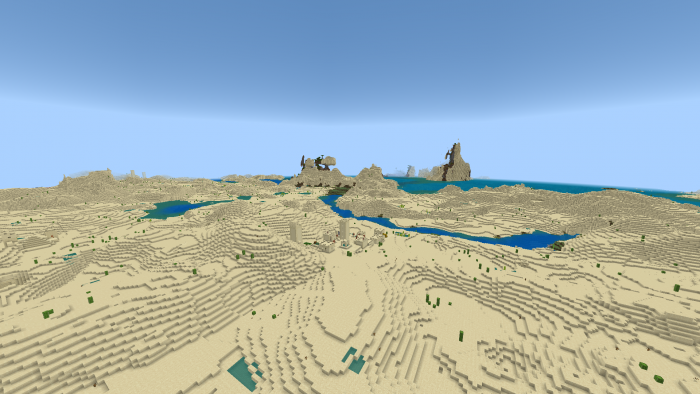

# Minecraft Bedrock Should Adopt Minecraft Legend's Custom World Generation System

## Just a little rant about why Bedrock should use Legends's custom world generation system

Author: SmokeyStack

Published: 2nd December 2023

## Background

When 1.18 was released, custom biomes on Bedrock broke due to the changes in the world generation system. Mojang has stated numerous times they are working ot bring back custom biomes to Bedrock Edition. Fast forward to 2023, Minecraft Legends was released. For those who don't know, Minecraft Legends is built using the Bedrock Engine, which means it is possible to make add-ons for it. I have been messing with Minecraft Legends's custom world generation system, and it's everything I wish Bedrock was. This blog is just me explaining why I think Bedrock should adopt Legends's custom world generation system.

## Biomes

Let's start with biomes and how they are different. In Legends, there are a few components not found or not fully implemented in Bedrock that I want ported: [overworld_height](https://docs.legendsmodding.com/world-generation/biome-components.html#badger-overworld-height), [rivers](https://docs.legendsmodding.com/world-generation/biome-components.html#badger-rivers), [sub_biomes](https://docs.legendsmodding.com/world-generation/biome-components.html#badger-sub-biomes) [visual_biome_attributes](https://docs.legendsmodding.com/world-generation/biome-components.html#badger-visual-biome-attributes). A schema for Legends's biome file can be found [here](https://github.com/Mojang/minecraft-legends-docs/blob/main/Biomes.md).

-   `overworld_height` can be used to define a biome's noise, Bedrock's custom biomes pre 1.18 could only define the noise params and noise type. In Legends, you can do that and additionally define the height params and frequency scale. This will be useful in creating the 1.18 terrain we see today.

-   `rivers` can be used to define the rivers between biomes, the density and type of river.

-   `sub_biomes` can be used to define the biomes within biomes. Back in 1.17, there used to be sub biomes like forest hills and jungle edge. We can use the `sub_biomes` to have mini oasis in deserts or define the border biomes to create transitions.

-   `visual_biome_attributes` can be used to define a biome's visuals like grass colour, water colour, fog, rain, and particles.

## Features

In Legends, their `single_block_feature` has a field called `may_not_attach_to` which is absent in Bedrock. It's such a simple thing I am dumbfounded why Bedrock doesn't have it. It also has a `random_rotation` field which will randomly rotate the block.

## Geology

The official Legends [docs](https://github.com/Mojang/minecraft-legends-docs/blob/main/GeologyService.md) perfectly describes what it is. It will be a welcoming feature for Bedrock to have. It allows us to generate terrain features that could not be easily achieve with the standard procedural terrain generation.

## Villages

In Bedrock, there is no way to make villages. In Legends, there is. Legends does village generation in an interesting way, it uses a deck system to place the village and buildings. In Java Edition, people will use jigsaw to connect buildings together. I'm happy with either method, but this blog is about why Bedrock should adopt Legends's world generaiton system so I will be discussing that.

In [Legends](https://github.com/Mojang/minecraft-legends-docs/blob/main/VillageGeneration.md), village generation is controlled by their scripting system. Their official docs explains in detail how it works. A simplified version: You create json files which act like cards, then via their scripting system, you pick some cards and place them into a deck. The village generation system will then use that deck to create a village.

## Conclusion

These are the features I would like to see be implemented into Bedrock's custom world generation system. A combination of the old plus Legends's system will be very revolutionary for custom world generation add-ons. Mojang doesn't have to fully switch over to Legends's system, but it would be nice if the features mentioned in this blog were ported.
