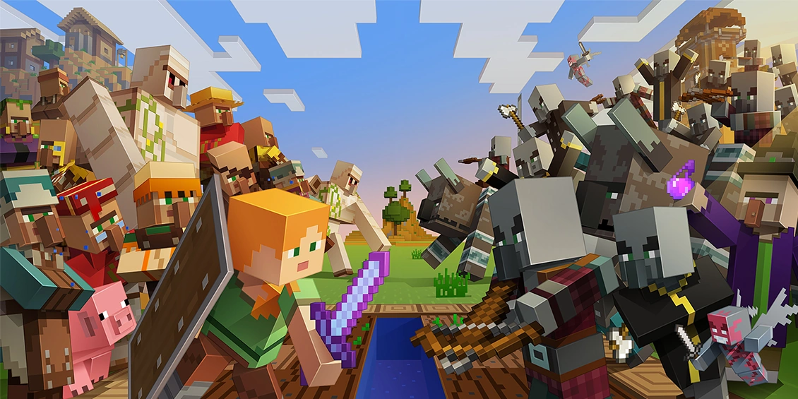
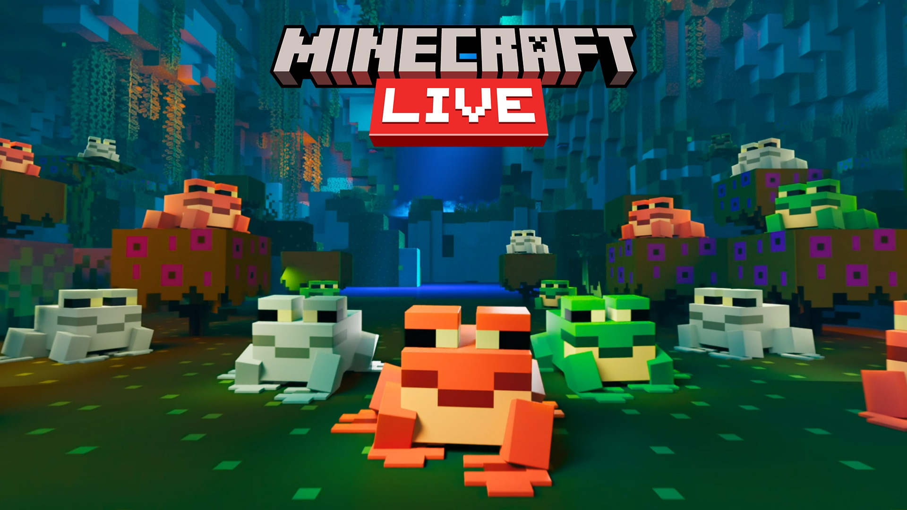
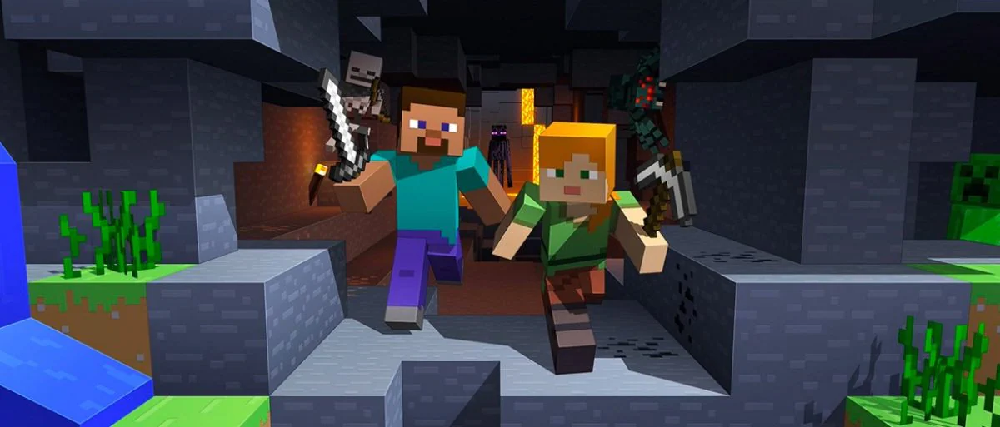
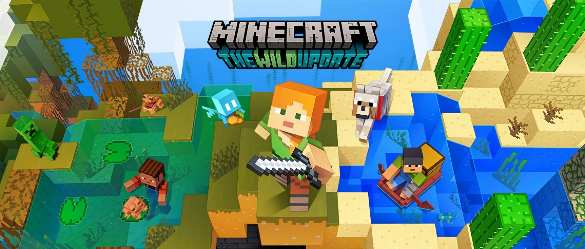

# Welcome to my blog!

    

    

        <a href="/blog/mojang-parity-goal">
            

                

                    
                

                

                    <h3>What Mojang's Goal For Parity Should Be</h3>
                    

                    
Parity update anyone?

                    
Published: 29th November 2022

                    

                

            

        </a>
    

    

    

        <a href="/blog/mob-vote-2022">
            

                

                    
                

                

                    <h3>My Thoughts on the Minecraft Live 2022 Mob Vote</h3>
                    

                    
Anyone else wished it was a biome vote instead?

                    
Published: 8th October 2022

                    

                

            

        </a>
    

    

    

        <a href="/blog/minecraft-live-2022">
            

                

                    
                

                

                    <h3>Minecraft Live 2022! Quick someone rig the mob vote!</h3>
                    

                    
The yearly live event hosted by Mojang Studios is back!

                    
Published: 20th September 2022

                    

                

            

        </a>
    

    

    

        <a href="/blog/chat_report_thoughts">
            

                

                    
                

                

                    <h3>My Thoughts on the Chat Reporting Feature for Minecraft Java Edition</h3>
                    

                    
Funny how the two most controversial updates for Minecraft: Java Edition end in 9. Anyone fancy a 1.29 update?

                    
Published: 1st July 2022

                    

                

            

        </a>
    

    

    

        <a href="/blog/wild_update_review">
            

                

                    
                

                

                    <h3>Minecraft The Wild Update has released! But does it live up to its expectations?</h3>
                    

                    
As the update releases for millions of players, the question everyone has been asking, "Is the update really Wild?"

                    
Published: 10th June 2022

                    

                

            

        </a>
    

    

