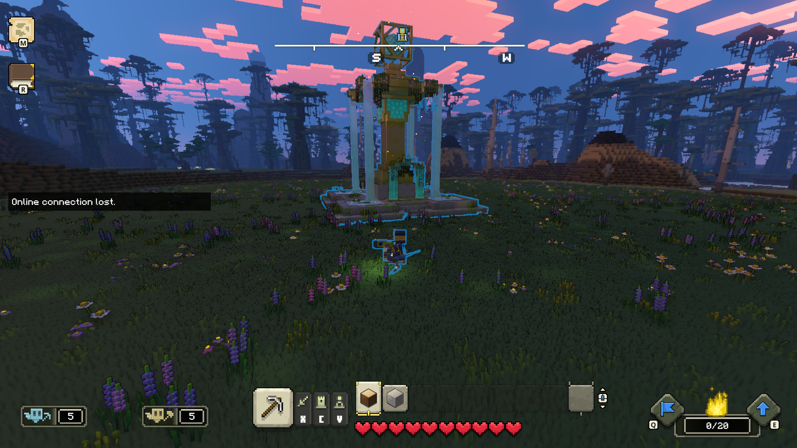
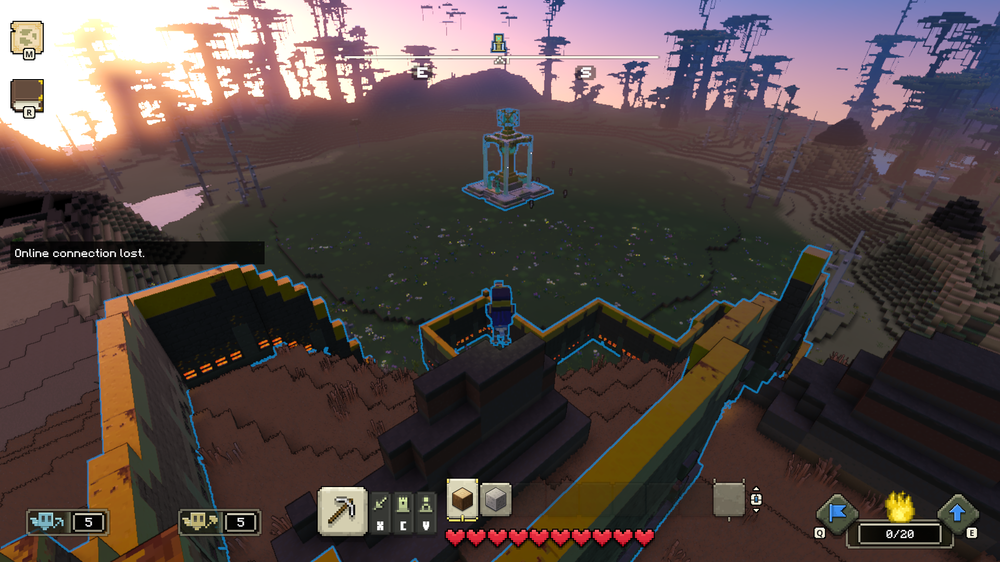
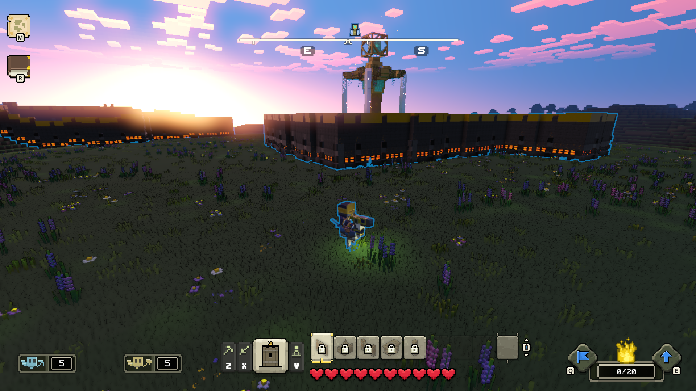

# Minecraft Legends Modding Devlog 1

## Where one legend ends, another one begins

Author: SmokeyStack

Published: 1st November 2023

## Welcome to My Devlog

This devlog is just to help me document my journey in modding Minecraft Legends. Will also be useful when editing the [modding wiki](https://docs.legendsmodding.com/). Why a blog and not a vlog? For starters my device that I play Legends on cannot even run the game smoothly so trying to record on top of that will be a nightmare. Secondly, I like writing like blogs.

My plan for modding Minecraft Legends, is to just mess around with the game. Minecraft Legends is based on a modified Bedrock Engine(Branch of 1.6/1.17). And there are some really cool things they have that I wish were ported to the main game. One of those cool things is their world generation api. So I decided to dabble in that then.

After poking through the code and countless hours, I managed to get a singular building to spawn.

What's interesting about Village Generation in Legends is, that it uses a DECK system. You have a deck which has cards in it. Each card represents something in the village. It could be a building, walls, districts or zones. The districts or zones can contain multiple cards. So when you're making a village you're essentially just making a deck of cards. At least that's how I interpret this system.

What I wanted to do next was place some walls around this singular building. So I looked at the [official modding docs](https://github.com/Mojang/minecraft-legends-docs/blob/main/WorldPlacement.md) and the vanilla files for references to the cards. I threw together something and got the walls to generate!...kind of.

Yeah...that's a bit too far from the center piece. My mistake was that I accidentally put `PlacementPreferenceCard(PLACEMENT_FAR_FROM_VILLAGE_START)` rather than `PlacementPreferenceCard(PLACEMENT_CLOSE_FROM_VILLAGE_START)` which tells the game to put the wall piece card the farthest away from the center. After fixing that mistake here's what I got.

So that concludes this first devlog. I hope to get more things done next week. I might dive into the biome system next. The community docs for village generation should be up sometime this month?
