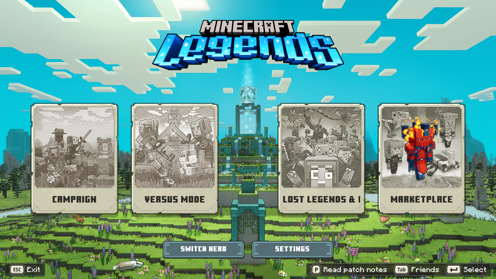
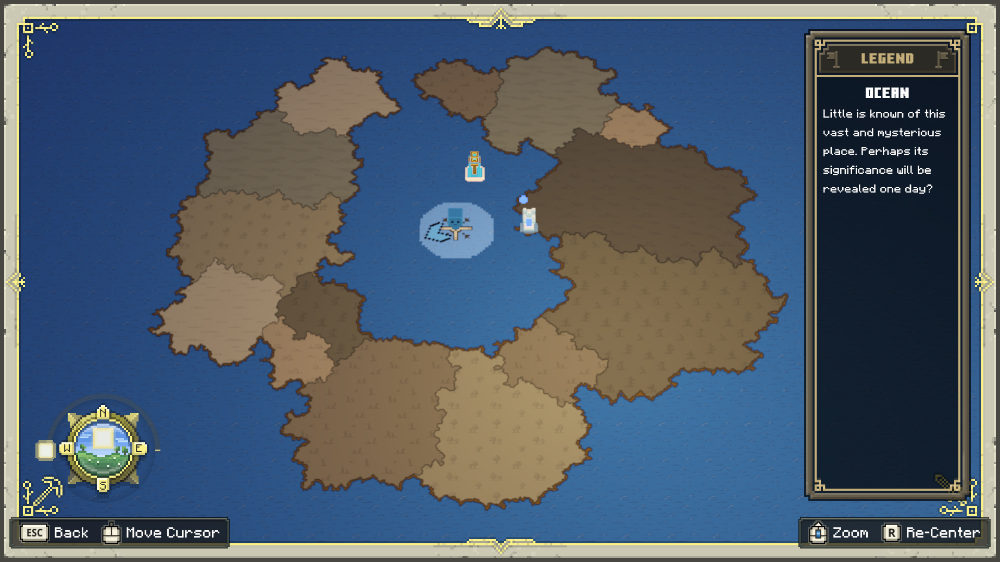
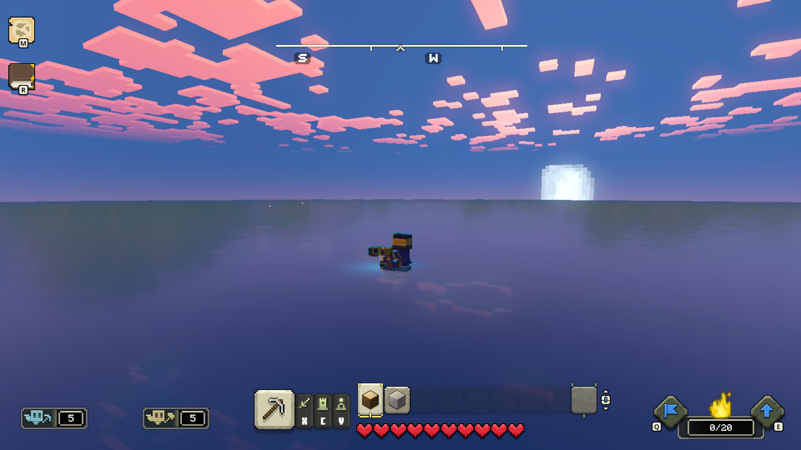
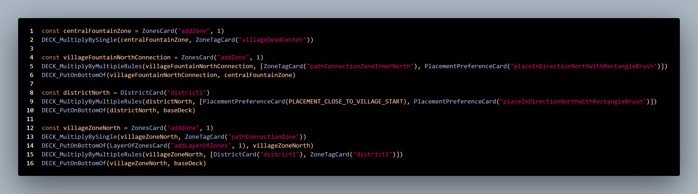
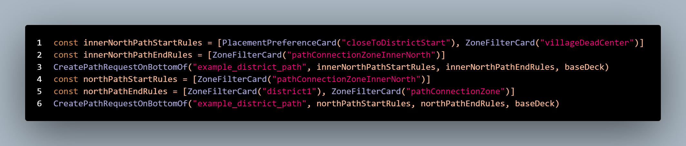
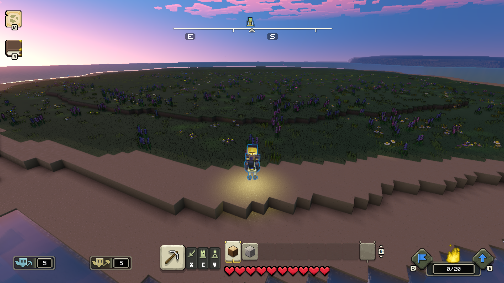

# Minecraft Legends Modding Devlog 2

## Paths and Connecting buildings together

Author: SmokeyStack

Published: 8th November 2023

## Devlog 2

Welcome to my second modding Minecraft Legends devlog. This week, I attempted to make paths connect from the village center to other buildings. Before I dive into that, here's something interesting, spawning in the middle of a giant lake.

Looking at the [official modding docs](https://github.com/Mojang/minecraft-legends-docs/blob/main/VillageGeneration.md#paths), I cobbled something together and achieved this. I noticed that my walls have turned into gates, the one connected to the path anyways.

I decided to remove the walls for now since it seems that the paths get offsetted. I created a central district, northern district, and northern zone using the following code below

This establishes the zones, but doesn't place the buildings yet. This time, I'm going to place the village fountain in the center and a village house in the northern district. After getting that code setup, it's time to tackle the paths. I essentially need to create 2 paths, one that goes from the center and pretrudes outward, another to connect from the northern zone to the center path. This code should do the trick. After booting up Legends here's what I got. It works! Now all I have to do is repeat 3 more times for the other cardinal directions.

After 10 minutes of setting up the code for the other cardinal directions, I booted up Legends...and was met with disappointment. Nothing generated.

So after, 20 minutes trying to figure out what was going on, I found out it was due to a typo...that was so frustrating. It's hard to debug Legends since there's no official console log or content log to tell you if something went wrong. After fixing the typo, the village finally generates.

So that concludes this second devlog. I hope to get more things done next week. I will probably continue working on this village, maybe adding more buildings, incorporate the walls, and more.
