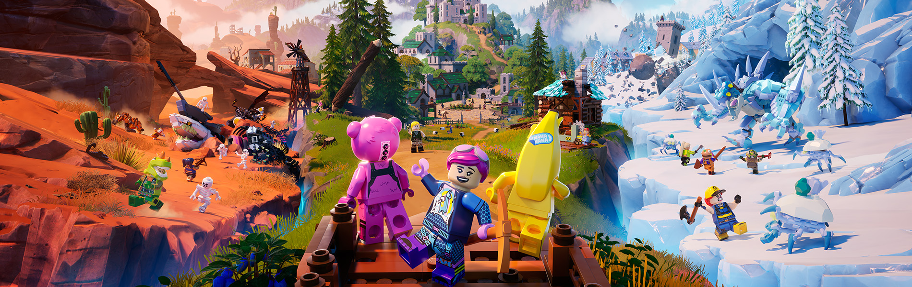

# My Thoughts on Lego Fortnite

## Lego Fortnite has been released and I decided to dive into Lego Fortnite to test it out and give my thoughts on it

Author: SmokeyStack

Published: 9th December 2023

## My Experience

Creating a Lego Fortnite World was easy, there's a menu with options for your world. I decided to go with the seed "2023". After spawning into a world you get greeted by an NPC that is essentially your in-game guide and tutorial. After going through with the tutorial which seems to end after you built your village squre, the rest was up to me. Taking my skills from Minecraft, I decided to just harvest the resources needed to build all four utility builds. The first three was easy, gather some granite and wood. The last one, the Spinning Wheel, was tricky to build. It required me to get wolf claw which meant I had to go exploring to find these guys. I spent maybe five minutes wandering around before I encountered a wolf. Defeating the wolf was easy. During this adventure, I encountered an NPC named Raptor and invited him along for the journey. We found a few abandoned/ruined structures and a butterfly that led me to a chest. After exploring for 15 minutes or so, I headed back to my village. I upgrade my village square which led to my first villager to appear. I gave him a job and that concludes my first playthrough of Lego Fortnite

## My Thoughts

I don't think it's going to be a Minecraft killer. It will however be a Minecraft competitor, and with competition breeds innovation. So looking forward to see how Mojang responds to this, because, I bet you they have eyes on this game.

Some things I find interesting:

-   Skeletons will rise from the ground, they don't magically pop into existence like Minecraft
-   Your villager rushes to you and cries when you die
-   Your villagers can dance with you
-   Wolves actual surround you when hunting you down
-   River in cold biomes are warm
-   Rivers also instakill enemies, might be a bug
-   Merge stack: This allows items in your inventory to be cleaned up essentially
-   Random encounters: rainbow butterfly that leads you to a chest

Some annoyances:

-   Can't skip the night
-   Can't pickup beds
-   Cant eat while moving
-   Swimming: If your energy/stamina bar runs out you get teleported back to shore
-   Soil plot doesn't tell what you can plant, you can put anything in the slot but it won't grow them

One thing I love about Epic Games is the community engagement. The LegoFortnite Twitter account has been posting a lot since the game launched, trying to market the game and engage with the community. This is something I wish Mojang did with Minecraft Legends or any of their games. A bit of a tangent, but the Fortnite Twitter account addressed player's concern about the new movement speed meanwhile Mojang hasn't addressed concerns about the copper bulb delay.

Another thing is feedback, I didn't manage to find any dedicated feedback page for Lego Fornite so hoping that will change. They do however have a [bug tracker page](https://trello.com/b/Bs7hgkma/fortnite-community-issues) so I'm glad that exists.

## Conclusions

I think Lego Fortnite will be a good competitor against Minecraft. Will it kill it? Probably not. Competition breeds innovation so I'm looking forward to Mojang's response. The game isn't perfect, it can be improved, but it has a good start. Now I'm just waiting for a Lego Fortnite wiki so I can open 20 tabs trying to play this game.
