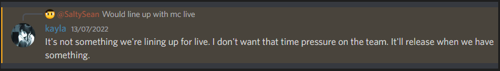

# Minecraft Live 2022! Quick someone rig the mob vote!

## The yearly live event hosted by Mojang Studios is back!

Author: SmokeyStack

Published: 20th September 2022

## What is Minecraft Live?

Minecraft Live is an annual event hosted by Mojang Studios. It is announced that this year's Minecraft Live will be held on [October 15th, 2022](https://www.minecraft.net/en-us/article/minecraft-live-2022-back)

> "Filmed live and beamed across the world via the internet! The show is packed with juicy Minecraft news, content creators, and will include a pre-show and community vote to actually influence the game!" - [Mojang Studios](https"//www.minecraft.net/en-us/live)

## What To Expect in This Year's Event

> As a disclaimer, while I may be part of the volunteer moderation team of the Official Minecraft, Minecraft Legends, and Minecraft Live Discord Servers, I have no affiliation with Mojang Studios or Microsoft.

This year, expect another 30 minute pre-show that is filled with content that the community has made over the past year. This is a great way to showcase the international community rather than just the English speaking one. They'll announce more things about Minecraft Dungeons. Since I don't play that game, I can't add anymore insight on it as I, in the past, have skipped the Dungeons part of the event. They'll announce more things about their new game, Minecraft Legends, which was leaked back in 2020. They usually showcase Creator Features, whether it's new features or community tools. Then they'll announce the theme of the next major update for Minecraft. Afterwards they'll announce the winner of this year's mob vote, more on that later. Of course the order of which things happen is subject to change. Now, what's confirmed to NOT be announced is the leaked Editor Mode, more on that later as well. 

(insert agnes quote)

### Editor Mode

The aforementioned Editor mode was discovered by me and countless other people. You can find the tweet where I discovered it [here](https://twitter.com/SmokeyStack_/status/1537119547278368771). It's been confirmed by [Kayla](https://twitter.com/kaylasara), a Minecraft Creator Platform Product Manager, that the team will not be announcing Editor Mode until they feel it is ready.

I will be posting another blog reviewing the things that I've discovered or "leaked", whatever you want to call it, after the show. Stay tuned for that.

## Mob Vote

Quick someone rig the mob vote! Jokes aside this year's mob vote is an interesting one. On April 30, 2022, I discovered something in the lang files that hint at an in-game server to host Minecraft Live. You can find the tweet [here](https://twitter.com/SmokeyStack_/status/1520425244716011521). On August 17th, 2022, a special event occurred on the Preview edition of Minecraft. Players were able to join a special server that Mojang Studios was trying to [stress test](https://twitter.com/JDavidFries/status/1560064291578863616). This gave me more suspicion that Minecraft Live was going to be an in-game event. But when Mojang Studios announced this year's Minecraft Live, it was revealed that the mob vote would be in-game! You can vote via the in-game server, the launcher, or on [their website](https://minecraft.net).

This will be held on October 14th, 2022, giving you 24 hours to vote. The results will be announced during Minecraft Live. Finally, a way to vote using in-house tools rather than rely on 3rd-party ones. Seems like Mojang really likes in-house tools nowadays.

## My Opinion on the Mobs

## Conclusion

Overall, I'm looking forward to this event, gives me something to be excited about for this game! I certainly will vote for [REDACTED].