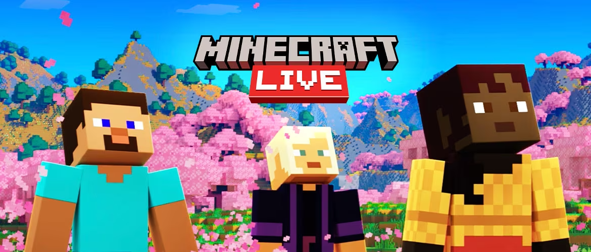

# Minecraft Live 2023! We will be there!

## The yearly live event hosted by Mojang Studios is back!

Author: SmokeyStack

Published: 14th September 2023

## What is Minecraft Live?

Minecraft Live is an annual event hosted by Mojang Studios. It is announced that this year's Minecraft Live will be held on [October 15th, 2023](https://www.minecraft.net/en-us/article/minecraft-live-2023-announcement)

> "If you’ve never watched our epic, once-a-year livestream before, then you are in for a treat. Not only do we spend an hour talking about Minecraft (our favorite topic), but we dive into news from Minecraft and Minecraft: Legends; share snippets of what you can expect in the future, and reveal the winner of the hotly anticipated mob vote!" - [Mojang Studios](https://www.minecraft.net/en-us/live)

## What To Expect in This Year's Event

> As a disclaimer, while I may be part of the volunteer moderation team of the Official Minecraft, Minecraft Legends, Minecraft Dungeons, and Minecraft Live Discord Servers, I have no affiliation with Mojang Studios or Microsoft.

This year, expect another 30 minute pre-show that is filled with content that the community has made over the past year. This is a great way to showcase the international community rather than just the English speaking one. They'll announce more things about Minecraft Legends. It is likely to be a new DLC announced or a halloween related update, more on that later. They usually showcase Creator Features, whether it's new features or community tools. Then they'll announce the theme of the next major update for Minecraft. Afterwards they'll announce the winner of this year's mob vote. Of course the order of which things happen is subject to change. This year, the mob vote will take place in-game and in the launcher just like last year. You'll get to choose between three candidates. We'll learn more about these candidates in early October.

### Legends

I expect them to announce a new DLC or a Halloween themed update. The files in the game suggest a Halloween themed update is very likely as instances of frogs, witches, and cauldrons have been found. More information can be found in [my tweet](https://twitter.com/SmokeyStack_/status/1654472261880135680) and [Miclee's tweet](https://x.com/thisisfr33dum/status/1688910980384976896). As for the DLC, references to a [Story DLC](https://x.com/SmokeyStack_/status/1673349531214258177) tab have been found. I'm also hoping for a section where they talk about Myths, they've been pushing Lost Legends but have only pushed three Myths, which were made by Marketplace Partners.

## Conclusion

Overall, I'm looking forward to this event, gives me something to be excited about for this game!
