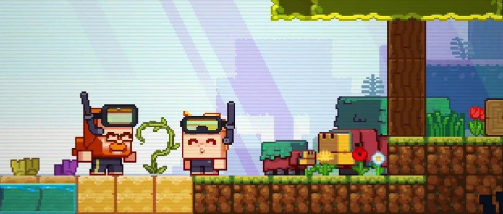
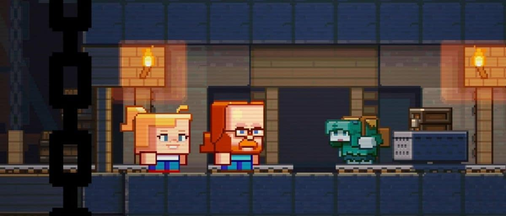
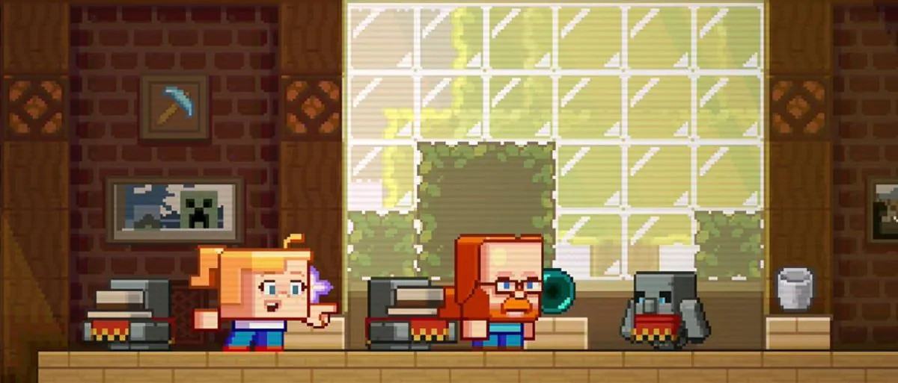

# My Thoughts on the Minecraft Live 2022 Mob Vote

## Anyone else wished it was a biome vote instead?

Author: SmokeyStack

Published: 8th October 2022

This past week, Mojang Studios have released videos and articles that tell us what we will be voting for this year. In this blog, I'll share my thoughts on each mob.

## The Sniffer

My first thoughts for the Sniffer was, "Oh, so it's a dinosaur?" because that's what it exactly looks like. But after rewatching the video and article about the Sniffer, I can see the potential of the Sniffer. Firstly is the lore, a once extinct beast brought back to life by you the player, sounds like Jurrasic Park if I'm being honest, let's hope the Sniffer doesn't try to eat you. The second potential encourages players to explore the oceans again. The Update Aquatic updated the oceans but now there's not much reason to explore them. Updates post 1.13 have brought features that make players revisit them. So voting for the Sniffer will give the oceans another reason for exploration, for a while that is.

### The Rascal

The Rascal is actually interesting, being a cave exclusive mob. Minecraft needs more of that. Now, the Rascal will bring a hide and seek gameplay, find it three times and it will reward you with a prize. I think that's cool, but when I'm down in the caves, I'm not there to get distracted, I'm there to gather materials.

## The Tuff Golem

Wow, someone at Mojang Studios really wants to add more golems to the base game. The Tuff Golem is essentially and item frame combined with the Copper Golem Concept from the Minecraft Live 2021 Mob Vote. Instead of a living entity turning into a statue, it's a statue that turns into a living entity. In the Minecraft article, it states we can customize it with a wool block to give it a cloak, which does bring a sense of uniqueness.

## Conclusion

Overall, all three mobs have great asthethics and brings a unique mechanic to the game. The only difference is how useful is the unique mechanic compared to each other. In the end, all three mobs are just concepts, so it makes sense that we don't have more information since the mobs aren't fleshed out yet. I know who I'm voting for, do you? Feel free to share your opinions with me on Twitter by tagging me @SmokeyStack_