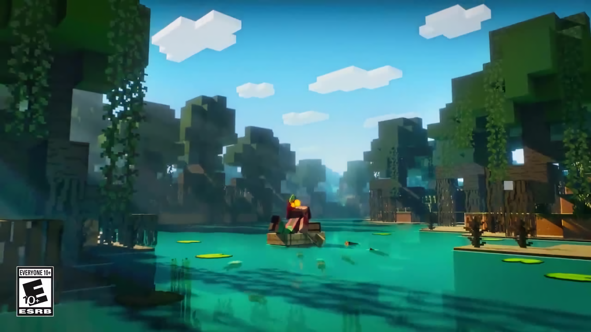
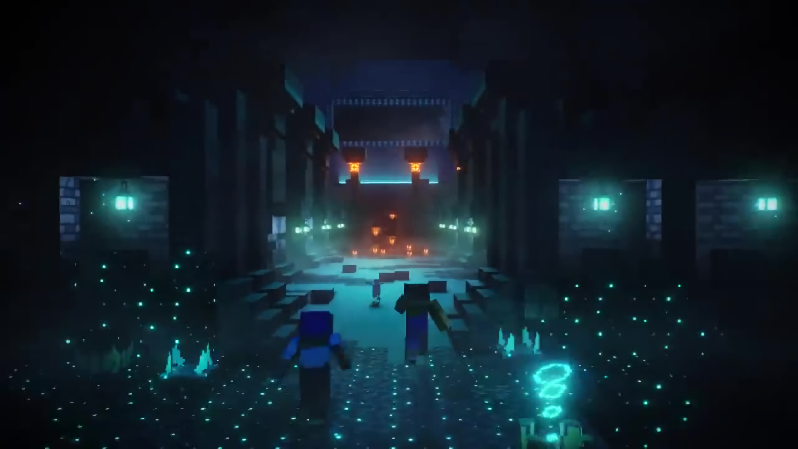

# Minecraft The Wild Update has released! But does it live up to its expectations?

## As the update releases for millions of players, the question everyone has been asking, "Is the update really Wild?"

Author: SmokeyStack

Published: 10th June 2022

[Minecraft The Wild Update has released](https://www.minecraft.net/en-us/updates/the-wild-update) bringing the long awaited Deep Dark and one of the loser from the [MINECON Live 2019 Biome vote](https://twitter.com/Minecraft/status/1177994460363460611). While it has been a hell of a ride watching the development of this update, many people have asked if the update actually lived up to its name. I intend to give you my opinion on this update.

## The Name

During Minecraft Live 2021, the developers revealed that 1.19 would be called the [Wild Update](https://youtu.be/w6zLprHHZOk?t=6390). Well, what does the Wild Update mean?

> "So the word 'wild' mainly means like two things for us. So the first thing is like beautiful nature. And the second thing is, like, really scary challenges and adventures." - Agnes Larsson, Minecraft Live 2021

With that word defined by the developers for us, let's take a dive into the features of 1.19 and see if it fits the definition.

## The Nature Part
Let's talk about the Mangrove Swamp. In this biome, we get a new tree feature unlike any we've seen. It consists of roots holding up the actual tree from the ground. It's very dense, almost like the jungle, but the roots are supposedly big enough to travel under them via boat. Frogs and bees can be found in this biome adding to the atmosphere.

## The Scary Part

Let's talk about the Deep Dark. This biome is my second favourite cave biome not because of it's material, but what lurks here. The entire biome is covered in sculk with patches of sculk sensors and sculk shriekers. These patches really make the biome scary since triggering them will summon the warden. What I love is that it introduces a new gameplay mechanic while exploring the biome.

What is this new gameplay mechanic? Stealth! You have to be quiet as to not summon the warden. "It's just a biome covered in sculk, not that exciting." you might be saying, well, there's a brand new structure called the Ancient City. It is the biggest structure in the overworld filled with unique loot and lore.

## The Community

During Minecraft Live 2021, the developers showed us in-game footage of fireflies. However, this idea was scrapped for 1.19 when they found out that fireflies are deadly to some frogs. It would've been really cool to see them at night which can create ambience. The developers also showed some concept art for the nature side of the Wild Update and one of them was a Birch Forest revamp. This led to the community having high expectations of it making into the game, because, why else would you show it off. But it was the community's fault for overhyping it. Concept art is not a commitment to anything. It's just an idea or a way to show a concept, crazy right? When the community found out that the Birch Forest wasn't going to be revamped, they got furious. These "two" scrapped features divided the community and they began to bash on the developers, calling them lazy and untrustworthy.

Shortly after an AskMojang video was released, the Minecraft community

### Caves and Cliffs part III

Some of the community are calling 1.19, Caves and Cliffs part III, since Mojang is finally introducing the Deep Dark into the game, which was a Caves and Cliffs feature. Developer Brandon Pearce gives us his thoughts on people calling the Deep Dark a 1.17 feature.

<blockquote>
&quot;Warden, Deep Dark and Ancient Cities don&#39;t count as new content because they were planned for 1.18&quot;  When we announced Deep Dark and Warden, the plan was much smaller than what we have in 1.19. Since 1.18, we&#39;ve been making it bigger. The differences are worth noting: <a href="https://t.co/KdHvTSx3zH">pic.twitter.com/KdHvTSx3zH</a>
&mdash; kingbdogz (@kingbdogz) <a href="https://twitter.com/kingbdogz/status/1523385865556627456?ref_src=twsrc%5Etfw">May 8, 2022</a></blockquote>

So really, it isn't justified to call 1.19 Caves and Cliffs part III.

### The Mild Update

Another suggestion the community is talking about is calling it the Mild Update. The reason being it isn't that exciting it's just an ok update. What they fail to realize is that the definition of "wild" is not just nature or crazy things.

## My Thoughts

I think that the developers did a great job at fulfilling the definition of "wild". The Mangrove Swamp made the overworld a bit more beautiful while the Deep Dark contains really scary challenges and adventures.

I am however disappointed, not at the developers, but at the community. Their reaction to the cancelled feature disgusted me. I have never felt so disappointed at the Minecraft community before. This should never happen again. The developers are humans as well!